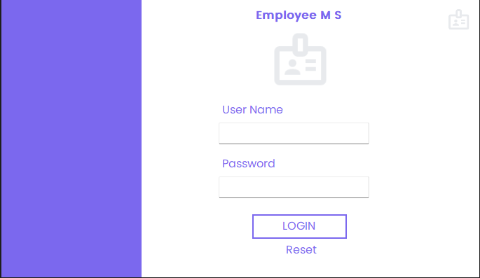
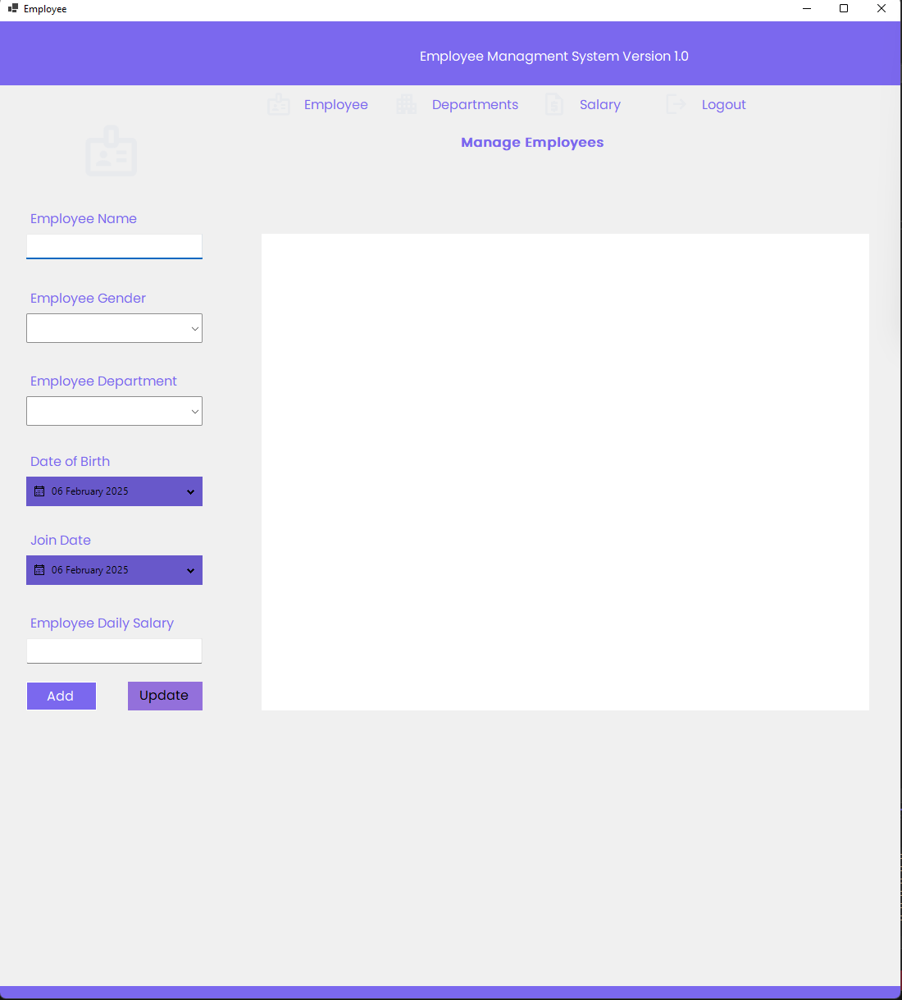

# **WinForms Employee Management System with SQL Database**

Welcome to the **WinForms-EmployeeManagementSystem-SQL** repository! 🚀 This project demonstrates how to create a **C# Windows Forms application** for managing employees with **SQL database integration**.



---

## **📂 Folder Structure**  

```
WinForms-EmployeeManagementSystem-SQL/
├── EmployeeManagementForm/  # Main WinForms UI for managing employees
├── Database/                # SQL scripts for employee database
├── README.md                # Project documentation
```

---

## **🛠 Features**  

✔ **Add, Edit, Delete Employees** – Manage employee records efficiently.  
✔ **SQL Integration** – Uses SQL Server for database storage.  
✔ **WinForms UI** – User-friendly interface for easy navigation.  
✔ **Search & Filter** – Find employees quickly.  

---

## **📌 Technologies Used**  

- **C# (.NET Framework/.NET Core)**  
- **Windows Forms (WinForms)**  
- **SQL Server**  
- **Entity Framework (Optional for ORM)**  

---

## **📖 How to Use**  

### **1️⃣ Clone the Repository**  

```bash
git clone https://github.com/YOUR_USERNAME/WinForms-EmployeeManagementSystem-SQL.git
cd WinForms-EmployeeManagementSystem-SQL
```

### **2️⃣ Setup the Database**  
- Run the SQL script from the `Database/` folder in SQL Server.  
- Update the **connection string** in `App.config`.  

### **3️⃣ Run the Application**  
- Open the project in **Visual Studio**.  
- Build and run the application.  

---

## **👨‍💻 Author**  

👤 **Kasam Ali Aftab**  
💼 **Software Engineer**  
📎 [LinkedIn Profile](#)  

Feel free to connect with me for collaboration or feedback!  

---

### 🚀 Happy Coding!  
